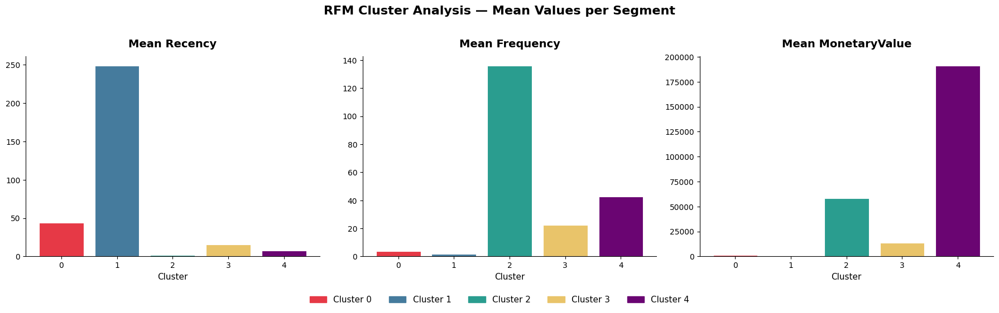

# 🛒 RFM Customer Segmentation using K-Means Clustering


---

## 📌 Project Overview

This project applies **unsupervised machine learning** to segment online retail customers based on their purchasing behavior using the **RFM framework** (Recency, Frequency, Monetary Value).

By clustering customers into distinct groups, businesses can design **personalized marketing campaigns** that improve customer retention, engagement, and revenue.

---

## 🎯 Business Problem

> You are the owner of an online retail store. You need to understand the needs and preferences of your customers in order to deliver more personalized and effective marketing campaigns — leading to increased customer retention and revenue.

**Goals:**
- Cluster customers using K-Means
- Find the optimal number of clusters using the **Elbow Method** and **Silhouette Score**
- Assign a cluster label to every customer
- Analyze and name each segment based on its characteristics
- Suggest actionable marketing strategies per segment

---

## 📊 What is RFM?

| Dimension | Description |
|-----------|-------------|
| **R — Recency** | How recently did the customer make a purchase? |
| **F — Frequency** | How many times has the customer purchased? |
| **M — Monetary Value** | How much has the customer spent in total? |

---

## 🗂️ Dataset

- **Source:** Online retail RFM dataset
- **File:** `rfm.csv`
- **Features used:** `Recency`, `Frequency`, `MonetaryValue`
- `CustomerID` was dropped (non-informative for clustering)

---

## 🔧 Tech Stack

| Library | Purpose |
|--------|---------|
| `pandas` | Data loading and manipulation |
| `numpy` | Numerical operations |
| `matplotlib` | Data visualization |
| `scikit-learn` | Preprocessing, KMeans, Silhouette Score |

---

## 🚀 Project Pipeline

```
1. Load Data
      ↓
2. Data Cleaning
   └── Check duplicates
   └── Drop CustomerID
      ↓
3. Preprocessing
   └── StandardScaler (zero mean, unit variance)
      ↓
4. Find Optimal K
   └── Elbow Method (Inertia)
   └── Silhouette Score
   → Optimal K = 5
      ↓
5. Train Final KMeans Model (K=5)
      ↓
6. Assign Cluster Labels
      ↓
7. Analyze Segments (groupby mean)
      ↓
8. Visualize & Name Segments
      ↓
9. Suggest Marketing Strategies
```

---

## 📈 Finding the Optimal K

Two methods were used to determine the best number of clusters:

### Elbow Method
- Inertia was computed for K = 2 to 10
- The curve showed a clear "elbow" at **K = 5**

### Silhouette Score
- Measures how well each point fits its assigned cluster vs. neighboring clusters
- Score ranges from -1 to 1 (higher = better)
- **K = 5** achieved the highest Silhouette Score

✅ Both methods confirmed **K = 5** as the optimal number of clusters.

---

## 📊 Cluster Analysis — Mean RFM Values



The bar charts above show the **mean Recency, Frequency, and MonetaryValue** for each of the 5 clusters identified by the K-Means model.

**Reading the charts:**

- **Mean Recency** — lower is better (customer purchased more recently). Cluster 1 stands out with the highest recency (~248 days), meaning these customers haven't purchased in a very long time. Cluster 2 has the lowest recency (~2 days), making them the most recently active group.

- **Mean Frequency** — higher means more purchases. Cluster 2 dominates with ~135 transactions, far above all other clusters. Cluster 4 follows with ~42 purchases, while Cluster 1 barely registers at ~2.

- **Mean MonetaryValue** — higher means more total spending. Cluster 4 is the clear leader at ~190,000, almost three times the spending of Cluster 2 (~60,000). Clusters 0 and 1 spend very little, suggesting low-value or disengaged customers.

These three charts together reveal the **distinct personality** of each cluster, and form the basis for naming and targeting each segment.

---

## 👥 Customer Segments

| Cluster | Name | RFM Profile | Key Insight |
|---------|------|-------------|-------------|
| 🔴 **0** | Dormant Customers | Recency: moderate · Frequency: low · Monetary: very low | Low engagement across all dimensions — at risk of being permanently lost |
| 🔵 **1** | Lost Customers | Recency: very high (~248d) · Frequency: very low · Monetary: very low | Haven't purchased in the longest time — most disengaged group |
| 🟢 **2** | Loyal Champions | Recency: very low (~2d) · Frequency: highest (~135) · Monetary: moderate | Most active and frequent buyers — highly engaged but moderate spenders |
| 🟡 **3** | Potential Loyalists | Recency: low · Frequency: moderate · Monetary: low-moderate | Balanced profile with growth potential — need nurturing |
| 🟣 **4** | High-Value VIPs | Recency: low · Frequency: high · Monetary: highest (~190K) | Biggest spenders — should be the top priority for retention |

---

## 📢 Marketing Strategy per Segment

| Segment | Recommended Strategy |
|---------|----------------------|
| 🔴 Dormant | Re-engagement campaign · "We miss you" email · Discount voucher |
| 🔵 Lost | Last-chance win-back offer · If no response, reduce marketing spend |
| 🟢 Loyal Champions | Upsell premium products · Bundle offers to increase cart value · Reward loyalty points |
| 🟡 Potential Loyalists | Loyalty program invitation · Early access to new products · Nurture emails |
| 🟣 High-Value VIPs | Subscription offers · VIP-exclusive events · Increase purchase frequency incentives |

---

## 📁 Repository Structure

```
RFM-Customer-Segmentation/
│
├── RFM_Exercise.ipynb          # Main notebook (full analysis)
├── rfm.csv                     # Dataset
├── rfm_clusters_colored.png    # Cluster visualization
└── README.md                   # Project documentation
```

---


## 🔑 Key Takeaways

- **RFM is powerful** — three simple numbers reveal deep patterns in customer behavior
- **Unsupervised learning works without labels** — KMeans discovered real structure with zero prior assumptions
- **K = 5 is optimal** — confirmed independently by both Elbow and Silhouette methods
- **Every segment is actionable** — each cluster maps directly to a distinct, targeted marketing strategy

---

## 👩‍💻 Author

**Insaf AlRumi**  
Data Science & ML Bootcamp — AXSOS Academy
